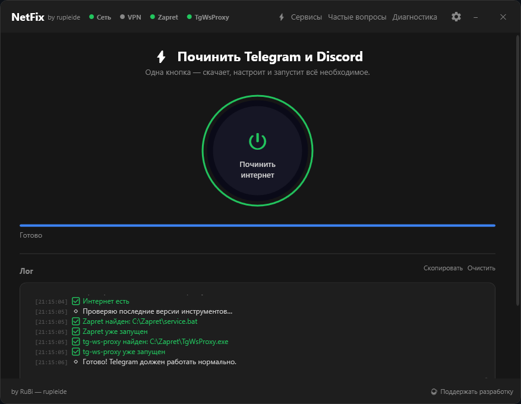
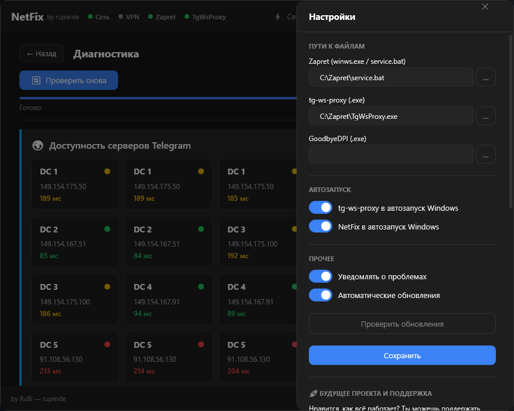
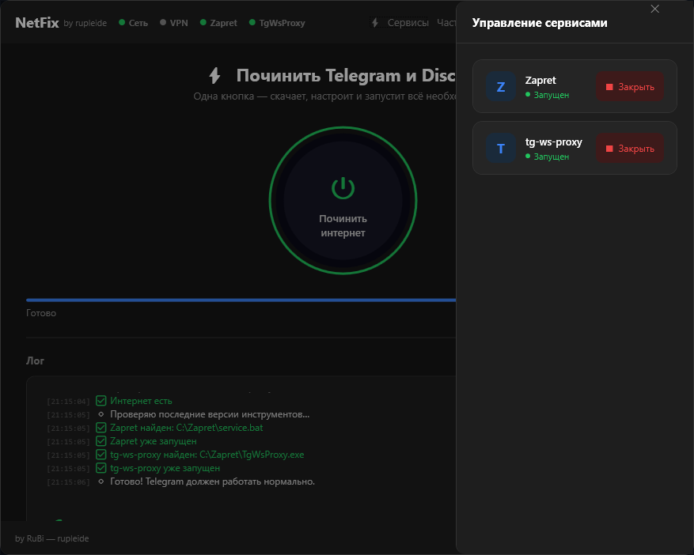
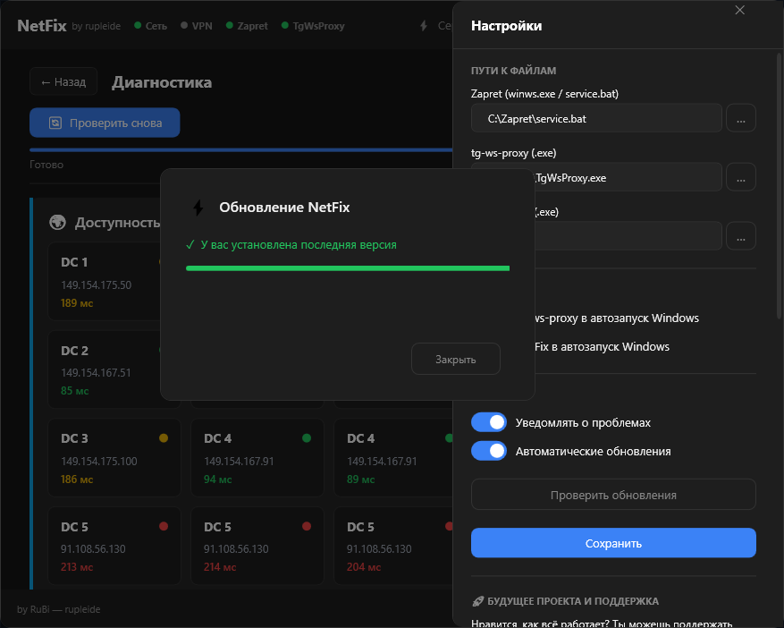
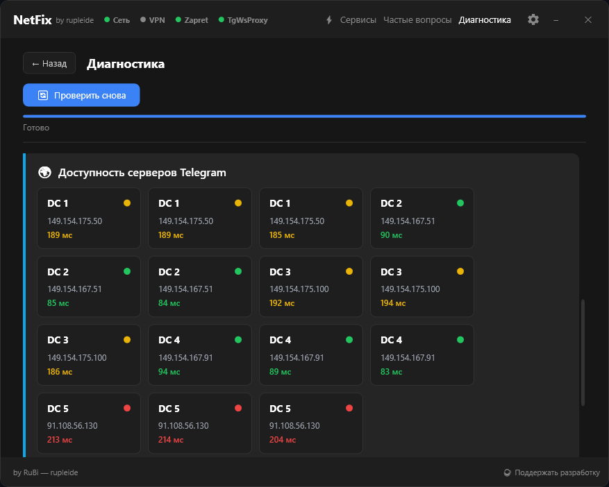

  
  
  # NetFix
  
  **Одна кнопка — и интернет снова работает**
  
  
  
  
  

---

## 💡 Зачем это нужно?

В современных реалиях доступ к привычным сервисам вроде **Telegram** и **Discord** часто ограничивается или полностью блокируется РКН. Существуют отличные инструменты вроде `zapret` или `tg-ws-proxy`, но их настройка через консоль и конфиги — задача не для каждого.

**NetFix** — это простая оболочка (GUI), которая делает всю грязную работу за вас. Вам не нужно быть системным администратором или уметь писать скрипты. 

> **От автора:** Я создал это приложение для своих друзей, которые постоянно просили помочь с неработающим Дискордом. Если вы здесь — значит, вам тоже надоело мучаться с настройками. Я сделал всё, чтобы вам не пришлось просить знакомых о помощи.

---

## ✨ Что умеет NetFix?

- ⚡ **Всё в одной кнопке** — Запускает необходимые службы, настраивает обход и одновременно проверяет наличие обновлений. Приложение само подскажет, что делать в любой ситуации.
- 📡 **Умная диагностика** — Покажет реальный статус доступности всех серверов Telegram (DC1-DC5) именно на вашем компьютере.
- 🛠 **Автоматизация** — Сама скачивает, распаковывает и настраивает компоненты обхода.
- ❓ **Человеческий FAQ** — Внутри приложения есть ответы на все вопросы. Я объяснил всё так, чтобы понял даже тот, кто "совсем не хочет думать".

---

## 🔍 Как работает диагностика и чем она полезна?

Функция **"Расширенная диагностика"** — это "глаза" пользователя. Она проверяет:
1. **Доступность серверов:** Проверяет прямые сокеты к дата-центрам Telegram.
2. **Статус служб:** Работает ли в данный момент прокси-сервер.
3. **Зачем это вам?** Если что-то не работает, диагностика покажет, где именно проблема. Вам не нужно гадать — программа сама сканирует сеть и выводит понятный статус (зеленый/красный).

---

## 📸 Скриншоты

  <h3>Главная панель управления</h3>
  
  
    

  <table border="0">
    <tr>
      <td width="50%" align="center">
        <b>⚙️ Настройки</b> 
        
      </td>
      <td width="50%" align="center">
        <b>🛠 Управление сервисами</b> 
        
      </td>
    </tr>
    <tr>
      <td width="50%" align="center">
        <b>🔄 Обновление</b> 
        
      </td>
      <td width="50%" align="center">
        <b>🌍 Выбор серверов</b> 
        
      </td>
    </tr>
  </table>

   

  <h3>❓ Ответы на вопросы (FAQ)</h3>
  

---

## ⚠️ Важное уточнение (Дисклеймер)

Это приложение **НЕ ДЛЯ ВСЕХ**. Если у вас и так всё отлично работает — оно вам не нужно. NetFix создан для тех, кто хочет нажать одну кнопку и забыть о проблемах.

**Благодарности:**
Я выражаю огромную благодарность разработчику **[Flowseal](https://github.com/Flowseal)**, который создал ядро системы — **Zapret** и **TgWsProxy**. 

**Юридическая информация:**
- Я **не являюсь автором** Zapret или TgWsProxy.
- Я сделал удобный интерфейс, который автоматизирует их работу.
- По вопросам работы самих алгоритмов обхода лучше обращаться к первоисточникам, я могу помочь только по работе интерфейса NetFix.

---

## 🚀 Как запустить?

1. Скачай последнюю версию → **[NetFix_Setup.exe](https://github.com/rupleide/NetFix/releases/latest)**
2. Запусти и нажми **"Починить интернет"**.
3. Наслаждайся свободным общением.

---

  Сделано с ❤️ для друзей и всех, кто ценит простоту.
   
  Разработчик: <a href="https://github.com/rupleide">rupleide</a>

