<div align="center">


<h1>NetFix</h1>

<p><b>Одна кнопка - и интернет снова работает</b></p>

[](https://github.com/rupleide/NetFix/releases/latest)
[](https://github.com/rupleide/NetFix/releases/latest)
[](https://github.com/rupleide/NetFix/releases)
[](https://www.virustotal.com/gui/file/8a5eb3a2ecf231285d2b577daf82750995c83524b17aac022d4395215fe6b983)
[](https://t.me/NetFixRuBi)
[](https://app.tonkeeper.com/transfer/UQCx8X4z86Jej2hc8l_IVni8e0Q8uDHhC8_PJ2zymxngVc2Q)
[](LICENSE)

</div>

---

## 💡 О проекте

В современных реалиях доступ ко многим привычным сайтам и сервисам (таким как **ChatGPT**, **Gemini**, **YouTube**, **Discord**, **Telegram** и др.) часто ограничивается или полностью блокируется. Настройка обходных путей через `zapret` или `tg-ws-proxy` вручную - задача нетривиальная.

**NetFix** - это интуитивно понятная оболочка (GUI), которая автоматизирует обход практически любых существующих блокировок без помощи сторонних VPN. Вы получаете стабильный и быстрый доступ к заблокированным ресурсам, ИИ-ассистентам и медиаплатформам в один клик: вам не нужно открывать консоль или вручную редактировать сложные конфигурации. Скачал, запустил, нажал кнопку - и всё работает.

> [!NOTE]
> **От автора:** Изначально я создавал это приложение для друзей, чтобы помочь им настроить доступ к Telegram и Discord. Но проект вырос в полноценный универсальный инструмент. Я сделал всё, чтобы вам не пришлось быть программистом для настройки сети - программа сама всё объяснит и наладит.

---

## 📥 Скачать

<div align="center">

| Источник | Ссылка |
|:---:|:---:|
| 🚀 GitHub (рекомендуется) | **[Скачать последнюю версию](https://github.com/rupleide/NetFix/releases/latest)** |
| ☁️ Google Drive (зеркало) | **[Открыть зеркало](https://drive.google.com/file/d/16X7Z74aEHOgKr63Yr5DGPUYlxotTsnUP/view)** |

</div>

### 📋 Системные требования:
*   **ОС:** Windows 10 / 11 (x64).
*   **Права:** Запуск от имени **администратора** (необходимо для работы драйвера WinDivert).
*   **Среда:** Наличие **[.NET Desktop Runtime](https://dotnet.microsoft.com/download/dotnet/8.0)**

---

## 📱 Будущее проекта: NetFix Mobile

Блокировки не ограничиваются только компьютером - на смартфонах они ощущаются еще сильнее.

В моих планах - реализовать полноценную мобильную версию **NetFix**. Это именно то приложение, которым я бы сам с удовольствием пользовался каждый день. Мобильный NetFix станет простым и надёжным инструментом, позволяя забыть о проблемах с доступом к любимым мессенджерам и сервисам сразу.

> *Следите за новостями в Telegram-канале, чтобы не пропустить анонс разработки!*

---

> [!IMPORTANT]
> **📢 Telegram-канал проекта**
>
> Я создал канал специально для этого проекта. Там я публикую новые найденные обходы, сообщаю о важных обновлениях Zapret, TgWsProxy и самого NetFix. Планирую активно развивать его - советую подписаться, чтобы не пропустить ничего важного.
>
> Также в комментариях под постами вы можете делиться своими кастомными уровнями для ритм-игры - я обязательно посмотрю каждую работу. Лучшие уровни будут опубликованы в канале, а самые качественные из них попадут в список официальных треков NetFix с указанием вашего авторства.
>
> <a href="https://t.me/NetFixRuBi" target="_blank">
>   
> </a>

---

## 🛡 Безопасность

> [!CAUTION]
> Программы, меняющие сетевые настройки, часто вызывают подозрение. Отвечу прямо.

- **Здесь НЕТ вирусов.** Мне нет никакого смысла заражать компьютеры своих друзей или пользователей.
- **Чистое ядро:** Приложение использует оригинальные наработки разработчика **[Flowseal](https://github.com/Flowseal)**.
- **Прозрачность:** NetFix - это просто удобный инструмент управления. Исходный код открыт и доступен для проверки.
- **Проверено VirusTotal:** [](https://www.virustotal.com/gui/file/8a5eb3a2ecf231285d2b577daf82750995c83524b17aac022d4395215fe6b983)

> [!WARNING]
> WinDivert может вызвать реакцию антивируса. Это нормально - WinDivert используется для перехвата трафика и может детектироваться как `Not-a-virus:RiskTool`. Добавьте папку программы в исключения антивируса.

---

## 🚀 Как это работает / Быстрый старт

<div align="center">


<p><i><b>Быстрый запуск обхода:</b> Активация служб и доступ к заблокированным ресурсам без VPN.</i></p>

<br/>

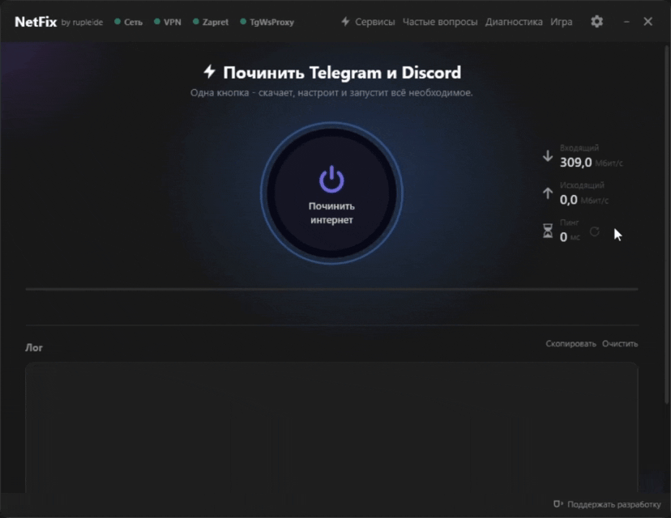

<p><i><b>Обзор ключевых возможностей:</b> Демонстрация работы программы и основных разделов за 30 секунд.</i></p>

</div>

---

## 🛠️ Вкладка «Модификации»

> [!TIP]
> **Настраивайте обход под себя: разблокируйте конкретные игры, нужные сайты или используйте готовые базы.**
> NetFix позволяет точечно управлять правилами обхода. Больше не нужно перебирать общие настройки - просто включите подходящий мод.

В NetFix добавлена продвинутая система модификаций для точечной настройки обхода под конкретные игры и веб-ресурсы. Теперь вы можете управлять всеми правилами Zapret и hosts-файлов из одного удобного окна: подключать готовые bat-стратегии для игр (EA App, Riot Games, Battlefield, League of Legends и др.), создавать листы доменов с поддержкой быстрого переноса Drag-and-Drop, использовать автоматически обновляемые базы hosts (dns.malw.link и GeoHide) с защитой от удаления, а также изменять любые файлы во встроенном редакторе и обмениваться модами через импорт и экспорт zip-архивов.

<div align="center">
<br/>

<table border="0" cellpadding="12">
  <tr>
    <td width="50%" align="center" valign="top">
      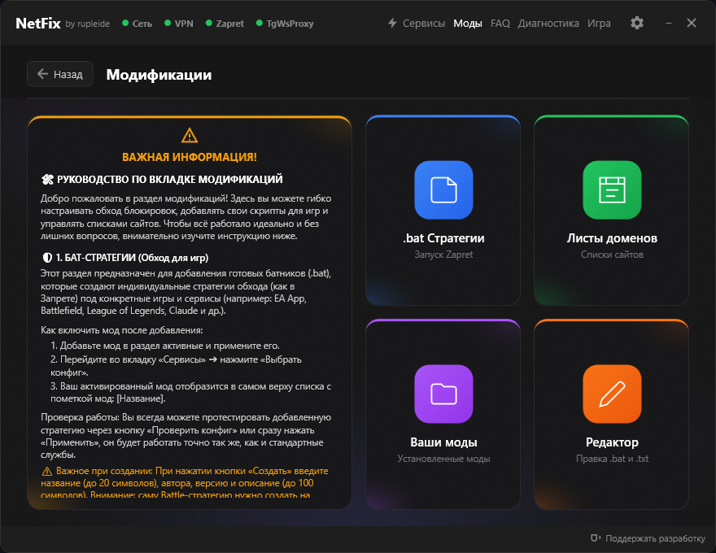<br/><br/>
      <b>🛠️ Менеджер модов</b><br/>
      <i>Управляйте всеми стратегиями, листами доменов и Hosts-файлами из одного окна.</i>
    </td>
    <td width="50%" align="center" valign="top">
      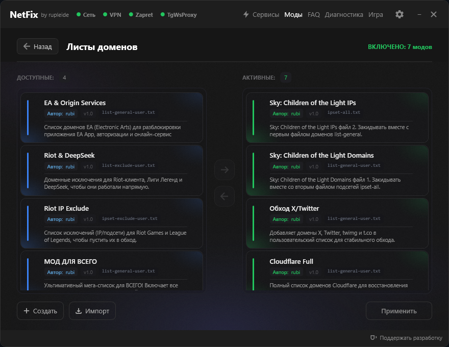<br/><br/>
      <b>🌐 Листы доменов</b><br/>
      <i>Перетаскивайте моды между разделами с помощью Drag-and-Drop.</i>
    </td>
  </tr>
</table>

</div>

---

<div align="center">

## 🆕 РАЗВЛЕЧЕНИЕ - ВСТРОЕННАЯ РИТМ-ИГРА

</div>

> [!TIP]
> **Пока программа чинит вам интернет - вам больше не придётся скучать.**

Сканирование конфигов занимает время. Раньше оставалось только смотреть в лог. Теперь - нет.

В NetFix встроена **полноценная ритм-игра** - и это не какая-то заглушка на время ожидания. Это игра, которую я сам горю желанием развивать: красивые визуальные эффекты, разлетающиеся частицы и звёзды при попаданиях, комбо-система, несколько встроенных треков и поддержка кастомных уровней. Всё это выглядит и ощущается по-настоящему круто - попробуйте сами.

Треками можно делиться: скидывайте свои уровни в комментарии Telegram-канала, лучшие работы попадут в официальный список треков NetFix с указанием вашего авторства.

<div align="center">


<p><i>Ритм-игра - встроена прямо в NetFix.</i></p>

<br/>

<table border="0" cellpadding="12">
  <tr>
    <td width="50%" align="center" valign="top">
      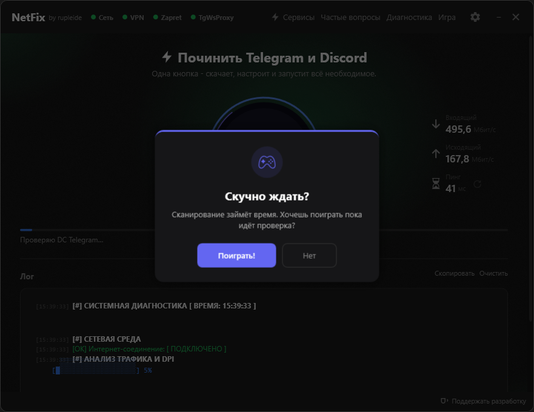<br/><br/>
      <b>💤 «Скучно ждать?»</b><br/>
      <i>Появляется автоматически во время сканирования. Один клик - и вы уже в игре.</i>
    </td>
    <td width="50%" align="center" valign="top">
      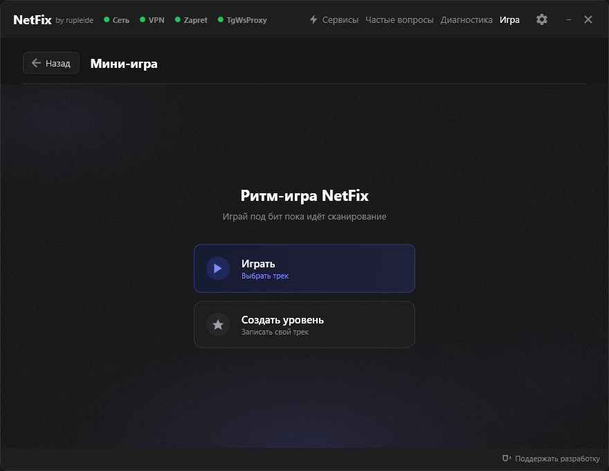<br/><br/>
      <b>🎮 Меню игры</b><br/>
      <i>Играть под готовый трек или создать собственный уровень - выбор за вами.</i>
    </td>
  </tr>
</table>

<br/>

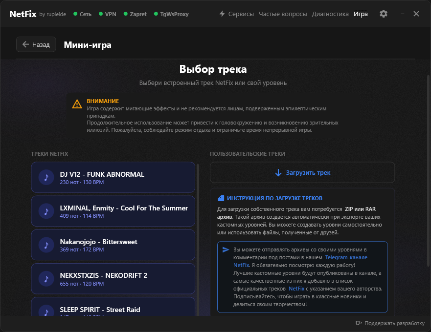

<p><i><b>🎵 Выбор трека:</b> Встроенные треки NetFix или собственные уровни - загружай ZIP-архив и играй под свою музыку.</i></p>

<br/>

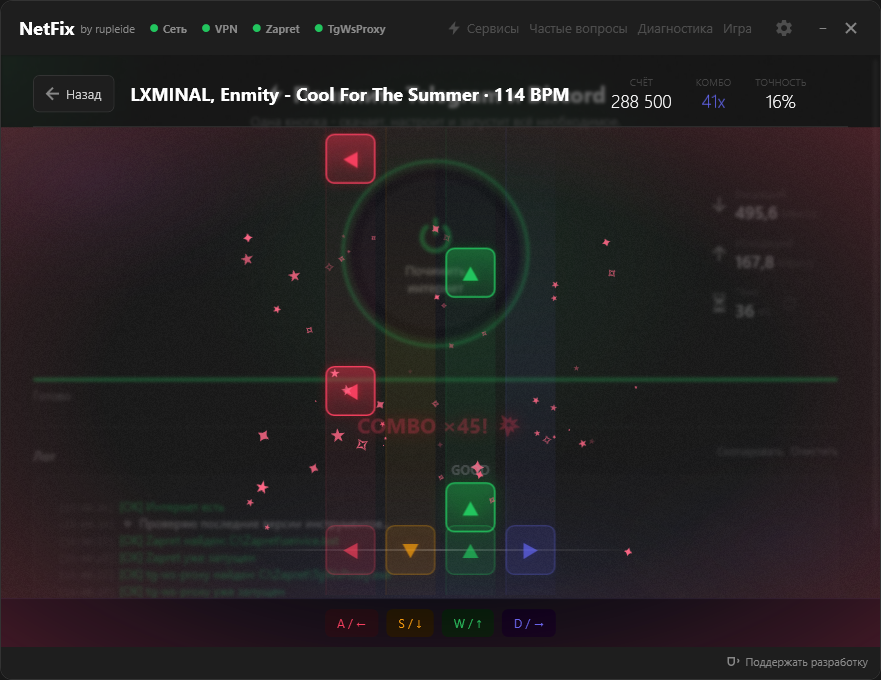

<p><i><b>🎮 Геймплей:</b> Квадраты падают сверху вниз в такт биту - попадай точно и строй комбо. При каждом успешном нажатии экран оживает: разлетаются частицы, вспыхивают звёзды, счётчик комбо растёт. Красивое тёмное оформление, плавные анимации и отзывчивое управление делают игру приятной даже в моменты, когда ждать совсем не хочется.</i></p>

</div>

---

## ⚙️ Дополнительные возможности

<div align="center">

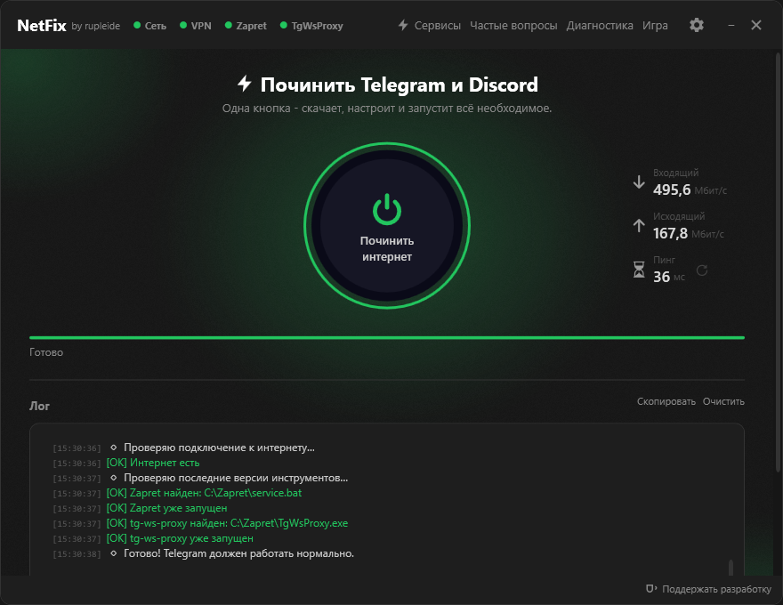

<p><i><b>Главный экран:</b> Одна кнопка запускает диагностику, проверяет соединение и активирует необходимые службы. Теперь также измеряет качество вашего интернета - пинг, входящую и исходящую скорость. Лог в реальном времени покажет каждый шаг.</i></p>

<br/>

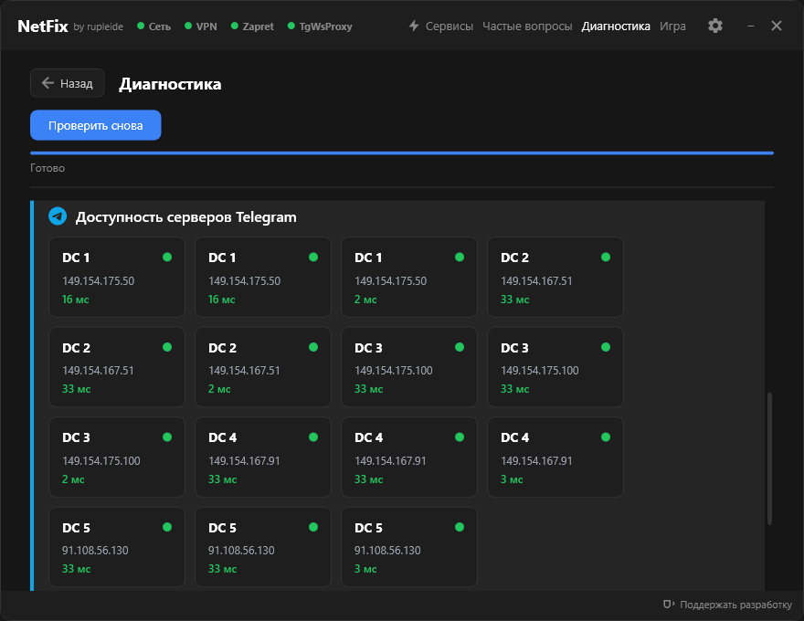

<p><i><b>Расширенная диагностика:</b> Проверяет пинг и доступность каждого дата-центра Telegram (DC1-DC5). Сразу видно, где именно "затык" в сети.</i></p>

<br/>

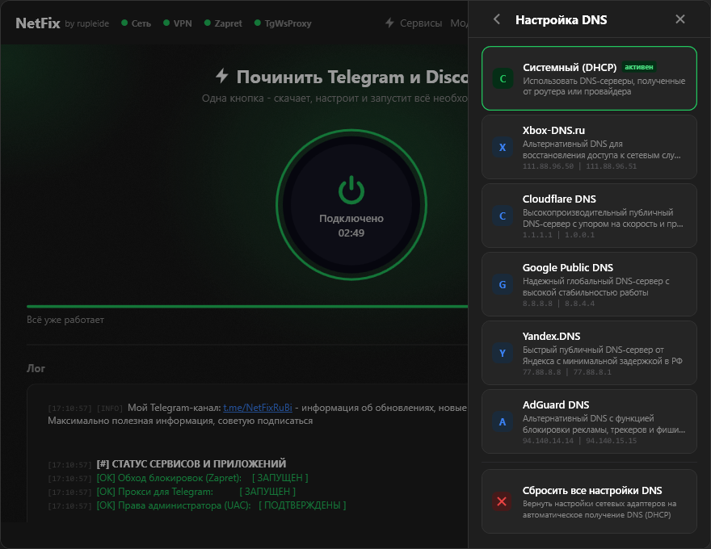

<p><i><b>Настройка DNS и DoH:</b> Выбирайте стабильные DNS-серверы (Xbox-DNS, Cloudflare, Google, Yandex, AdGuard) и активируйте зашифрованный протокол DNS-over-HTTPS для полной защиты от перехвата трафика провайдером.</i></p>

<br/>

<table border="0" cellpadding="12">
  <tr>
    <td colspan="2" align="center">
      <h3>✨ ОБНОВЛЕНИЕ: Умный подбор конфигурации Zapret</h3>
    </td>
  </tr>
  <tr>
    <td width="50%" align="center" valign="top">
      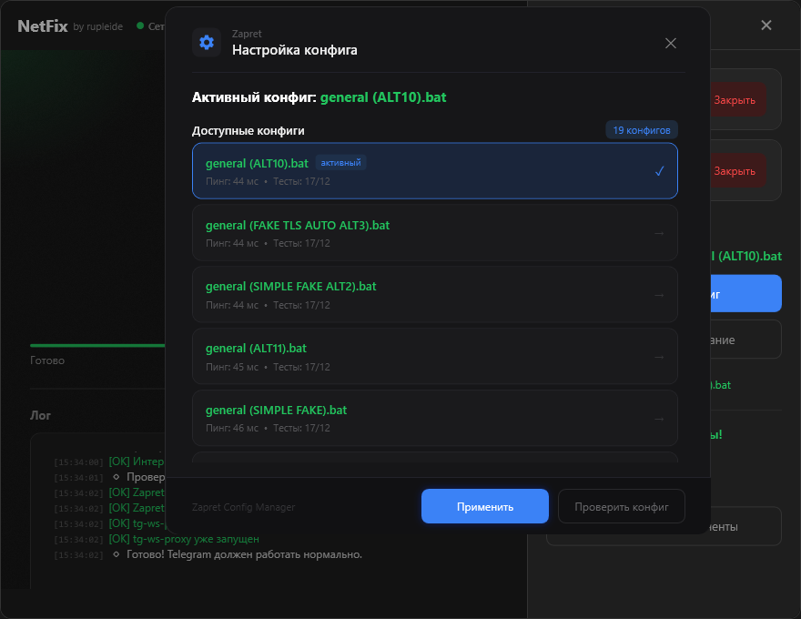<br/><br/>
      <b>📑 1. Выбор конфига</b><br/>
      <i>Список конфигов, отсортированный по качеству работы: от идеальных до менее стабильных.</i>
    </td>
    <td width="50%" align="center" valign="top">
      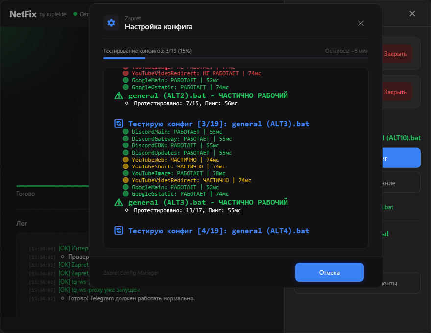<br/><br/>
      <b>🔍 2. Сканирование конфигов</b><br/>
      <i>Автоматическая проверка всех конфигов на работоспособность с сохранением лучшего результата в память.</i>
    </td>
  </tr>
</table>

<br/>

<table border="0" cellpadding="12">
  <tr>
    <td width="50%" align="center" valign="top">
      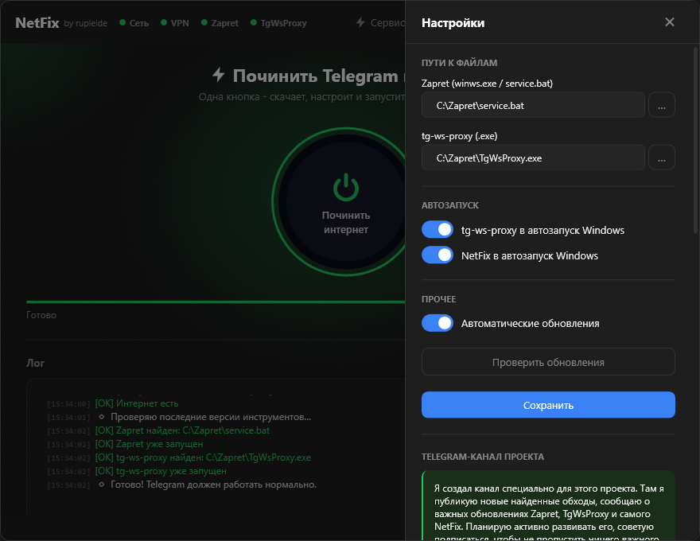<br/><br/>
      <b>⚙️ Гибкие настройки</b><br/>
      <i>Управление путями к файлам и автозагрузкой в одном окне. Здесь же - экспорт и импорт настроек, чтобы не пересканировать всё заново после переустановки Windows.</i>
    </td>
    <td width="50%" align="center" valign="top">
      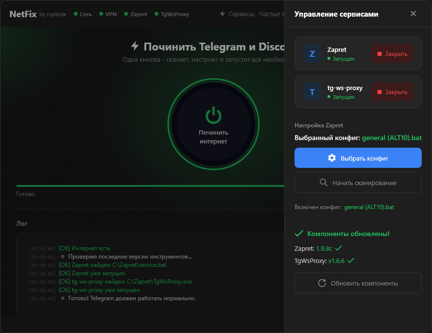<br/><br/>
      <b>🛠 Управление сервисами</b><br/>
      <i>Быстрый доступ к запуску и остановке Zapret и TgWsProxy по отдельности, а также обновление компонентов.</i>
    </td>
  </tr>
  <tr>
    <td width="50%" align="center" valign="top">
      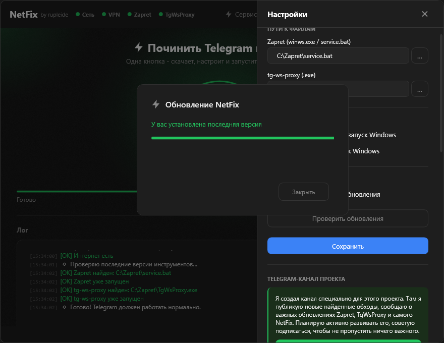<br/><br/>
      <b>🔄 Автообновление</b><br/>
      <i>Программа сама следит за новыми версиями и предлагает обновиться в один клик.</i>
    </td>
    <td width="50%" align="center" valign="top">
      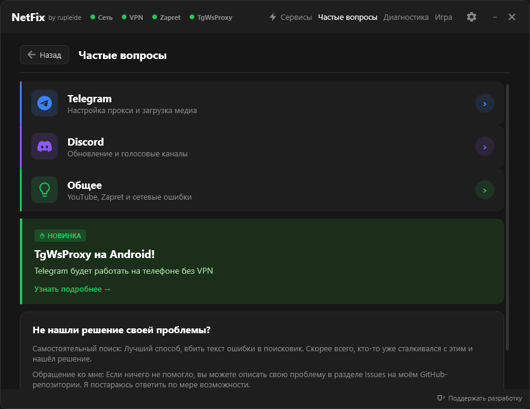<br/><br/>
      <b>❓ Понятный FAQ</b><br/>
      <i>Все типичные проблемы и их решения - чтобы не пришлось никого просить о помощи.</i>
    </td>
  </tr>
</table>

</div>

---

## 🛠 Для разработчиков

Если хотите разобраться в коде или внести свой вклад - добро пожаловать!

Просто клонируйте репозиторий. Все файлы, которые компилируются в `.exe`, уже находятся в репозитории, за исключением встроенных треков ритм-игры.

```bash
git clone https://github.com/rupleide/NetFix.git
```

### 📋 Требования

- **Среда:** [.NET Desktop Runtime 8.0](https://dotnet.microsoft.com/ru-ru/download/dotnet/thank-you/runtime-desktop-8.0.25-windows-x64-installer) (нужна именно версия `windowsdesktop-runtime-8.0.25-win-x64`)
- **IDE:** Visual Studio (любая версия с поддержкой .NET 8 и WPF)

### 🔨 Сборка

1. Открыть `NetFix.sln`
2. Нажать **Сборка → Собрать решение**

**Всё. Никаких дополнительных шагов.**

> [!NOTE]
> Сторонние компоненты (Zapret, TgWsProxy) в репозитории отсутствуют - это намеренно. Пользователь устанавливает их сам через встроенную автоматическую или ручную установку, которая скачивает их напрямую с официальных репозиториев авторa:
> - [Flowseal/zapret-discord-youtube](https://github.com/Flowseal/zapret-discord-youtube)
> - [Flowseal/tg-ws-proxy](https://github.com/Flowseal/tg-ws-proxy)

---

> [!CAUTION]
> ### 🚫 Пожалуйста, не создавайте отдельные форки NetFix
>
> Я вижу форки и понимаю интерес к проекту - это приятно. Но разрозненные версии вредят всем: пользователи путаются какой NetFix настоящий, обновления и фиксы до них не доходят, а доверие к проекту размывается.
>
> Если есть идея, улучшение или найденный баг, откройте Pull Request или напишите мне лично в Telegram. Я отвечу всем в обязательном порядке, и если изменение стоящее, добавлю его с указанием вашего авторства! Так ваш вклад увидят **все** пользователи NetFix, а не только те кто случайно наткнулся на форк.

<div align="center">
<br/>

[](https://github.com/rupleide/NetFix/pulls)
&nbsp;
[](https://t.me/rupleide)

</div>

---

## 💎 Поддержать проект

*Если NetFix помог вам - вы можете поддержать разработку донатом*

<div align="center">
<br/>

<table border="0" cellpadding="24" width="700">
  <tr>
    <td align="center" valign="middle" width="350">
      <h3>💎 Toncoin (TON)</h3>
      <code>UQCx8X4z86Jej2hc8l_IVni8e0Q8uDHhC8_PJ2zymxngVc2Q</code>
      <br/><br/>
      <a href="https://app.tonkeeper.com/transfer/UQCx8X4z86Jej2hc8l_IVni8e0Q8uDHhC8_PJ2zymxngVc2Q">
        
      </a>
    </td>
    <td align="center" valign="middle" width="350">
      <h3>⚡ Перевод по СБП</h3>
      <i>Работает с любого банка России</i>
      <br/><br/>
      <a href="https://www.tbank.ru/rm/r_eELpDmupvc.SCiWRkVJON/bgKkD30493/">
        
      </a>
    </td>
  </tr>
</table>

<br/>

❤️ Каждый донат мотивирует продолжать развитие проекта. Спасибо!

</div>

---

## ⚠️ Официальные источники

Единственный официальный репозиторий: [github.com/rupleide/NetFix](https://github.com/rupleide/NetFix)  
Официальный Telegram-канал: [t.me/NetFixRuBi](https://t.me/NetFixRuBi)  

Если вы обнаружили репозиторий или сборку, имитирующую NetFix - сообщите через GitHub DMCA:  
[https://support.github.com/contact/dmca-takedown](https://support.github.com/contact/dmca-takedown)

> [!CAUTION]
> ### 📜 ЛИЦЕНЗИЯ ОБЯЗАТЕЛЬНА К ПРОЧТЕНИЮ АВТОРАМ ФОРКОВ

<details>
<summary><b>Раскрыть - условия GPL-3.0 + Section 7 Additional Terms</b></summary>
<br/>

Данное ПО распространяется под лицензией **GPL-3.0**.

На основании **Раздела 7 (Section 7)** лицензии GPL-3.0, к любым производным работам (модификациям, форкам, альтернативным сборкам) применяются следующие **дополнительные обязательные требования**:

- **Исходный код (NetFix):** © 2024-2026 [rupleide](https://github.com/rupleide). Свободно для изменения и распространения при строгом сохранении оригинального авторства и открытости кода изменений.
- **Сторонние компоненты (Zapret, TgWsProxy):** Все права принадлежат их автору - **[Flowseal](https://github.com/Flowseal)**. Я не являюсь автором инструментов `Zapret` и `TgWsProxy`.

### ⚠️ Специальные требования к модифицированным версиям (Форкам)

Любое лицо или группа лиц, создающие форк NetFix, компилирующие изменённые исходники или распространяющие альтернативные сборки, **обязаны беспрекословно соблюдать следующие условия**:

1. **Запрет оригинального бренда (Борьба с фейками):**
   - Запрещено использовать название **NetFix** (а также любые названия, способные ввести пользователя в заблуждение относительно происхождения программы) в названии программы, репозитория, исполняемого файла (EXE), папок установки, Telegram-каналов или сайтов. Проект должен быть полностью переименован (например, в *BypassDPI-WPF*).
   - Запрещено использовать оригинальный логотип NetFix (иконку с щитом) и официальные промо-материалы. Использование логотипа NetFix, промо-материалов или значительных фрагментов README без изменений является нарушением авторского права и может быть предметом DMCA Takedown на платформе GitHub.

2. **Обязательное уведомление (Legal Notice) при запуске:**
   - На основании **GPL-3.0 Section 7(b) и 7(c)**, любой форк при первом запуске **обязан** отображать уведомление о неофициальном характере сборки со следующим текстом:  
     **«ВНИМАНИЕ! Вы запускаете неофициальный форк программы NetFix. Оригинальный автор (rupleide) не имеет отношения к этой сборке, не гарантирует её безопасность и не оказывает поддержку. Оригинальный чистый NetFix доступен по адресу: github.com/rupleide/NetFix»**
   - Вырезание этого уведомления является прямым нарушением лицензии.

3. **Обязательная маркировка и техническая изоляция:**
   - На основании **GPL-3.0 Section 7(c)**, в заголовке главного окна приложения (Title) и в окне «О программе» форка должен постоянно и недвусмысленно отображаться текст: `(fork of NetFix by rupleide)`.
   - Любая модифицированная версия обязана изменить идентификатор приложения (Assembly GUID / Application ID) так, чтобы он не совпадал с оригинальным NetFix.

4. **Защита от недобросовестного сбора средств:**
   - На основании **GPL-3.0 Section 7(d)**, запрещается использовать имя оригинального автора (rupleide) или оригинальное название NetFix для рекламы, продвижения или сбора пожертвований.
   - Если форк содержит кнопки пожертвований, форкер обязан либо оставить оригинальные реквизиты автора (`rupleide`), либо полностью удалить их и переименовать раздел сборов под свой бренд. Подмена реквизитов на свои с сохранением текста о поддержке оригинального проекта NetFix/rupleide запрещена как искажение происхождения ПО.

5. **Запрет скрытого использования официальных API:**
   - Форк не имеет права использовать официальный GitHub API оригинального репозитория NetFix для автоматического обновления сторонних сборок, чтобы не создавать нагрузку на лимиты запросов оригинального автора.

6. **Обязательное и одновременное раскрытие исходного кода:**
   - В соответствии с GPL-3.0 Section 6, при публикации любого скомпилированного релиза (EXE) форкер **обязан одновременно с публикацией бинарника** предоставить прямую, рабочую ссылку на открытый исходный код всех изменений на GitHub.
   - Запрещается распространять скомпилированные бинарники без одновременно опубликованного и доступного исходного кода. Любой релиз без публично доступных исходников является прямым нарушением лицензии.

---

**Юридические последствия и бан:**
Любое нарушение данных правил (например, удаление обязательного предупреждения при старте, сохранение названия NetFix или скрытие исходного кода) аннулирует право на использование и распространение кода проекта.

Нарушающие репозитории будут **немедленно заблокированы** администрацией GitHub через официальную процедуру **DMCA Takedown Notice** без предварительных уведомлений.

</details>

**Отказ от ответственности:** Программа предоставляется «как есть». Автор не несёт ответственности за последствия использования ПО. Используя NetFix, вы подтверждаете, что делаете это на свой страх и риск.

---

<div align="center">
  <sub>Разработано с ❤️ для тех, кто хочет просто нажать на кнопку</sub><br/>
  <sub>v1.1.6 · 2026</sub>
</div>
